<div align="center">
  
  
  # ClaWatch
  
  ### **Monitor, control, and auto-fix your AI agents.**
  
  *Open source observability for OpenClaw agents — real-time observability, cost guardrails, and autonomous issue resolution*
  
  [](https://www.npmjs.com/package/clawatch)
  [](https://opensource.org/licenses/MIT)
  
  [**🚀 Live Demo**](https://clawatch.dev/dashboard) · [**📦 npm**](https://www.npmjs.com/package/clawatch) · [**⭐ Star on GitHub**](https://github.com/GENWAY-AI/clawatch)
</div>

---

## Why ClaWatch?

Your AI agents spawn sub-agents, burn tokens, call tools, and sometimes get stuck in loops or blow through API credits. **ClaWatch doesn't just show you what's happening — it steps in.** Set cost thresholds that auto-pause runaway agents. Get intelligent alerts that explain *why* something broke. Let the auto-fixer resolve common failures before you even wake up.

Visibility is table stakes. ClaWatch gives you **control and autonomy** — so your agents run reliably while you sleep.

Built for teams shipping AI products. Open source. Free forever.

---

## ✨ Features

<table>
<tr>
<td width="50%">

### 🛡️ **Cost Guardrails & Auto-Pause**
Set daily or monthly spend limits per agent. When a threshold is hit, ClaWatch auto-pauses the agent before it drains your credits — no human in the loop required.

</td>
<td width="50%">

### 🔧 **Autonomous Issue Resolution**
Stuck in a loop? Crashed mid-task? ClaWatch detects common failure patterns and auto-resolves them — restart agents, kill runaway sessions, and recover gracefully.

</td>
</tr>
<tr>
<td>

### ⏯️ **Control Agents from Anywhere**
Pause, resume, or stop agents directly from the dashboard or your phone. One click, instant effect — even at 3 AM from your bed.

</td>
<td>

### 🚨 **Smart Alerts That Explain Why**
Not just "agent crashed." ClaWatch tells you *what* failed, *why* it happened, and *what it did about it*. Telegram, Slack, or webhook — your choice.

</td>
</tr>
<tr>
<td>

### 📊 **Unified Session View**
Group sessions into projects for a bird's-eye view. See cost, timeline, and agent breakdown across related work. Interactive charts with zoom.

</td>
<td>

### 🌐 **Multi-Profile Support**
Monitor multiple OpenClaw installations from one dashboard. Switch profiles instantly — dev, staging, production.

</td>
</tr>
</table>

---

## 🚀 Quick Start

### Install

```bash
npm install -g clawatch
```

### Start Monitoring

```bash
clawatch start
```

That's it! ClaWatch auto-detects your OpenClaw agents and opens the dashboard at `http://localhost:3001`.

### Add Alerts (Optional)

```bash
# Get Telegram notifications when agents misbehave
export TELEGRAM_BOT_TOKEN="your_bot_token"
export TELEGRAM_CHAT_ID="your_chat_id"

clawatch start
```

---

## 🛠️ CLI Commands

| Command | Description |
|---------|-------------|
| `clawatch start` | Auto-detect agents, start monitoring, and open the dashboard |
| `clawatch stop` | Stop the monitoring daemon gracefully |
| `clawatch status` | Show active agents, sessions, and daemon health |
| `clawatch logs` | Stream real-time logs from the monitoring daemon |

---

## 🏗️ How It Works

```
┌──────────────────┐
│  OpenClaw Agents │  (~/.openclaw/*)
│  Sessions, Logs  │
└────────┬─────────┘
         │
         ▼
┌──────────────────┐      ┌──────────────────┐      ┌──────────────────┐
│  ClaWatch CLI    │─────▶│  Backend API     │─────▶│  Alert Channels  │
│  (Daemon)        │      │  Express+SQLite  │      │  Telegram/Slack  │
└──────────────────┘      └────────┬─────────┘      └──────────────────┘
                                   │
                          ┌────────▼─────────┐
                          │   Web Dashboard  │
                          │   (Next.js)      │
                          └──────────────────┘
                         http://localhost:3001
```

1. **CLI daemon** watches `~/.openclaw/` for agent activity
2. **Backend API** aggregates data into SQLite
3. **Dashboard** visualizes everything in real-time
4. **Alert system** watches for anomalies and notifies you

---

## 🦞 Works with Your Stack

ClaWatch auto-detects your agent framework. Full support today, more coming soon.

| Framework | Status |
|-----------|--------|
| [🦞 OpenClaw](https://openclaw.ai) | ✅ Fully supported |
| [NanoClaw](https://nanoclaw.net) | ✅ Fully supported |
| [ZeroClaw](https://zeroclaw.dev) | 🔜 Coming soon |
| [TrustClaw](https://www.trustclaw.app) | 🔜 Coming soon |
| [Nanobot](https://nanobot.ai) | 🔜 Coming soon |
| [PicoClaw](https://picoclaw.dev) | 🔜 Coming soon |

Want support for your framework? [Request it →](https://github.com/GENWAY-AI/clawatch/issues)

---

## 🔔 Alert Channels

Get notified where your team already works.

| Channel | Status | Setup Guide |
|---------|--------|-------------|
| 📱 **Telegram** | ✅ Live | [Setup docs](https://github.com/GENWAY-AI/clawatch#add-alerts-optional) |
| 💬 **Slack** | 🔜 Soon | Coming soon |
| 🎮 **Discord** | ✅ Live | [Join our community](https://discord.gg/A7mYjwja) |
| 📧 **Email** | 🔜 Soon | Coming soon |
| 📟 **PagerDuty** | 🔜 Soon | Coming soon |

### Alert Types

- 🔴 **Agent Crash** — Agent stopped unexpectedly
- 🔁 **Infinite Loop** — Agent stuck repeating the same action
- 💸 **Cost Spike** — Agent exceeded hourly/daily budget
- 🕐 **Agent Stalled** — No activity for >10 minutes
- ⚠️ **High Error Rate** — Multiple tool call failures

---

## 🐳 Self-Host with Docker

Want to run ClaWatch on a remote server? Use Docker:

```bash
git clone https://github.com/GENWAY-AI/clawatch.git
cd clawatch
docker build -t clawatch .
docker run -p 3001:3001 -e TELEGRAM_BOT_TOKEN=xxx clawatch
```

Supports any platform with Docker: **AWS, GCP, Azure, Hetzner, Digital Ocean, Render, Fly.io**.

---

## 💻 Runs Where You Run

If OpenClaw runs there, ClaWatch runs there.

- ✅ macOS (Apple Silicon & Intel)
- ✅ Linux (Ubuntu/Debian)
- ✅ Windows WSL
- ✅ Raspberry Pi
- ✅ AWS / GCP / Digital Ocean / Hetzner

---

## 🧑‍💻 Development

### Prerequisites

- Node.js 18+
- npm or pnpm

### Local Setup

```bash
# Clone the repo
git clone https://github.com/GENWAY-AI/clawatch.git
cd clawatch

# Backend
cd backend
npm install
npm run dev        # http://localhost:3001/api

# Frontend (new terminal)
cd frontend
npm install
npm run dev        # http://localhost:3000

# CLI (new terminal)
cd cli
npm install
npm run build
npm link           # Makes `clawatch` command available
```

### Project Structure

```
clawatch/
├── cli/              # Monitoring daemon + CLI
│   ├── src/
│   │   ├── cli.ts    # Main entry point
│   │   └── daemon.ts # Background monitoring
│   └── package.json
├── backend/          # Express API
│   ├── src/
│   │   ├── index.ts  # Server
│   │   ├── routes/   # REST endpoints
│   │   └── db.ts     # SQLite schema
│   └── package.json
├── frontend/         # Next.js dashboard
│   ├── app/          # Pages
│   ├── components/   # React components
│   └── package.json
├── Dockerfile        # Production container
└── API_CONTRACT.md   # Backend API docs
```

---

## 📈 Roadmap

### ✅ Shipped

- [x] Real-time agent monitoring
- [x] Cost tracking (per agent, per model)
- [x] Telegram alerts
- [x] Multi-profile support
- [x] Session logs & project grouping
- [x] Agent control (pause/resume)
- [x] Docker support for self-hosting
- [x] Pure WASM SQLite (no native deps)
- [x] Interactive analytics with chart zoom & URL persistence

### 🚧 In Progress

- [ ] Agent Auto-Fixer (autonomous failure detection & recovery)
- [ ] Slack integration
- [ ] Discord bot
- [ ] Custom alert rules builder

### 🔮 Coming Soon

- [ ] NanoClaw/ZeroClaw/TrustClaw support
- [ ] Multi-user auth & teams
- [ ] Agent performance scoring
- [ ] Cost prediction
- [ ] Webhook alerts
- [ ] Email alerts

[**Vote on features →**](https://github.com/GENWAY-AI/clawatch/discussions)

---

## 🤝 Contributing

We love contributions! Bug reports, feature requests, and PRs are all welcome.

### How to Contribute

1. **Fork the repo** and create a feature branch
2. **Make your changes** (add tests if applicable)
3. **Open a PR** with a clear description
4. **We'll review** and merge within 48 hours

### Good First Issues

Check out issues labeled [`good first issue`](https://github.com/GENWAY-AI/clawatch/labels/good%20first%20issue).

---

## 💬 Community & Support

- **GitHub Discussions**: [Ask questions, share tips](https://github.com/GENWAY-AI/clawatch/discussions)
- **GitHub Issues**: [Report bugs, request features](https://github.com/GENWAY-AI/clawatch/issues)
- **Email**: hello@genway.ai

---

## 📜 License

MIT © [GENWAY AI](https://github.com/GENWAY-AI)

Free to use in commercial products. See [LICENSE](./LICENSE) for details.

---

<div align="center">
  
  ### **Built with ❤️ by [GENWAY AI](https://genway.ai)**
  
  [Website](https://clawatch.dev) · [GitHub](https://github.com/GENWAY-AI/clawatch) · [npm](https://www.npmjs.com/package/clawatch)
  
</div>
